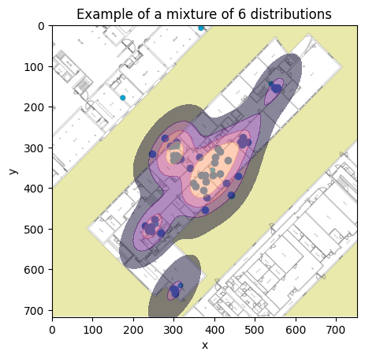

# `Floor Heatmap`

## Create a space occupation heatmap in python from a set of coordinates, still very rough
It creates a set of clusters around the coordinates (dots), and from those clusters, creates a heatmap using kernel density estimation (kde). 
In the future, as the input image gets more precise, the clusters will be limited to the image limits, so that dots won't appear beyond the room limits.

 

### Input:

### Output:

